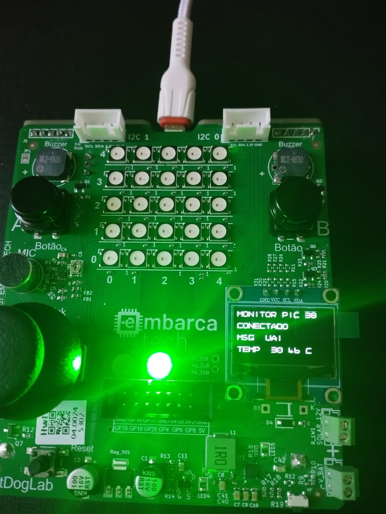
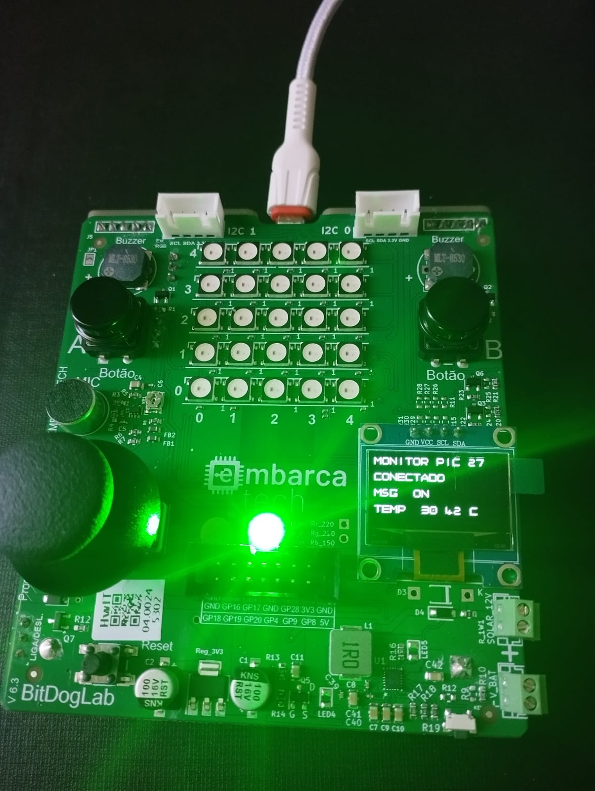
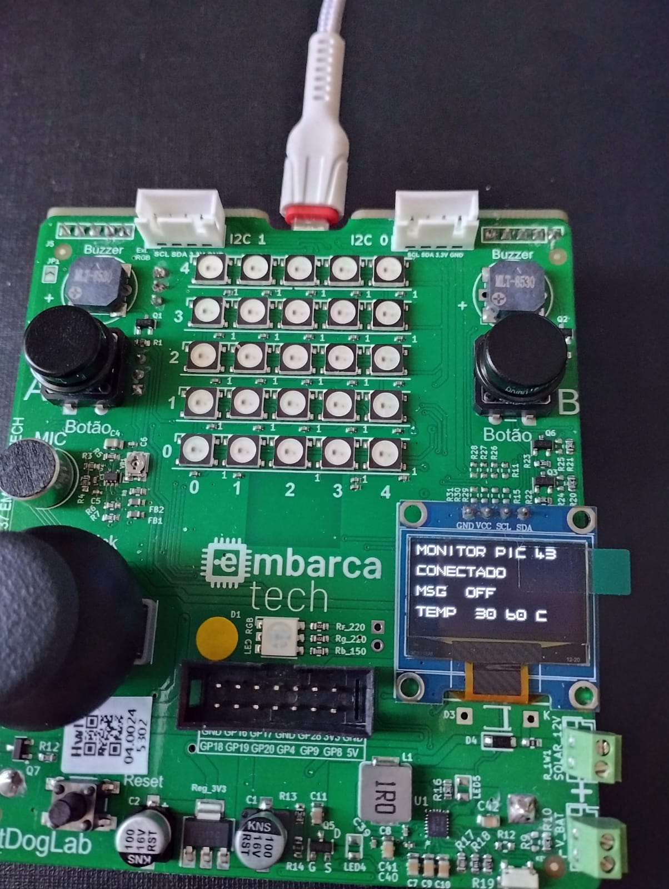

## Monitor BitDogLab MQTT PICO W
Sistema de monitoramento via MQTT para o hardware educacional BitDogLab, permitindo a coleta e visualização de dados em tempo real.

  

## 🔍 Visão Geral
Este projeto conecta sensores do BitDogLab a um broker MQTT, transmitindo dados de temperatura, ativando e desativando o LED e recebendo mensagens. 

## 🚀 Pré-requisitos
Hardware
- BitDogLab - Raspberry Pi Pico W
- Sensores: Temperatura e LED

## Broker MQTT
- HiveMQ Edge

## Consumidor
- Qualquer cliente MQTT ou sistema 

## 🎯 Funcionamento
- É essencial ativar o HiveMQ Edge, com o broker em funcionamento o aplicativo MQTT Studio será conectado para visualizar a comunicação. Por fim, basta executar o código,
após colocar para rodar o HiveMQ Edege vá ao programa MQQT Studio e subscreva com o nome do topico que foi definido no código, intitulado como pico-led-controle.
- Agora vá ao vscode e coloque o programa para rodar, lembrando que você deve estar conectado a mesma rede que definiu no código para estabelecer a conexão.
- No terminal do vscode, na parte do Serial Monitor ele receberá as  informações do sensor com a voltagem e temperatura em graus celsius, informa que o led é 0,
então está apagado e envia uma mensagem para o tópico bitdoglab/temperature.
- Na imagem a seguir pode ser notado que foi publicada a mensagem "on" no MQTT Studio e esta é recebida pela placa no display OLED,
juntamento com a temperatura e o LED Verde é ativado, isto tudo também pode ser verificado no serial monitor do VSCode.

  

- No próximo passo foi publicada a mensagem "uai" no MQTT Studio é recebida pela placa no display OLED, juntamento com a temperatura e o LED Verde continua ativo,
isto tudo também pode ser verificado no serial monitor do VSCode.

  

- E por fim a mensagem "off" foi publicada no MQTT Studio e é recebida pela placa no display OLED, juntamento com a temperatura e o LED Verde é desativado, isto
tudo também pode ser verificado no serial monitor do VSCode.

  

## 📚 Referências
- BitDogLab 
- Broker HiveMQ
- MQTT 
